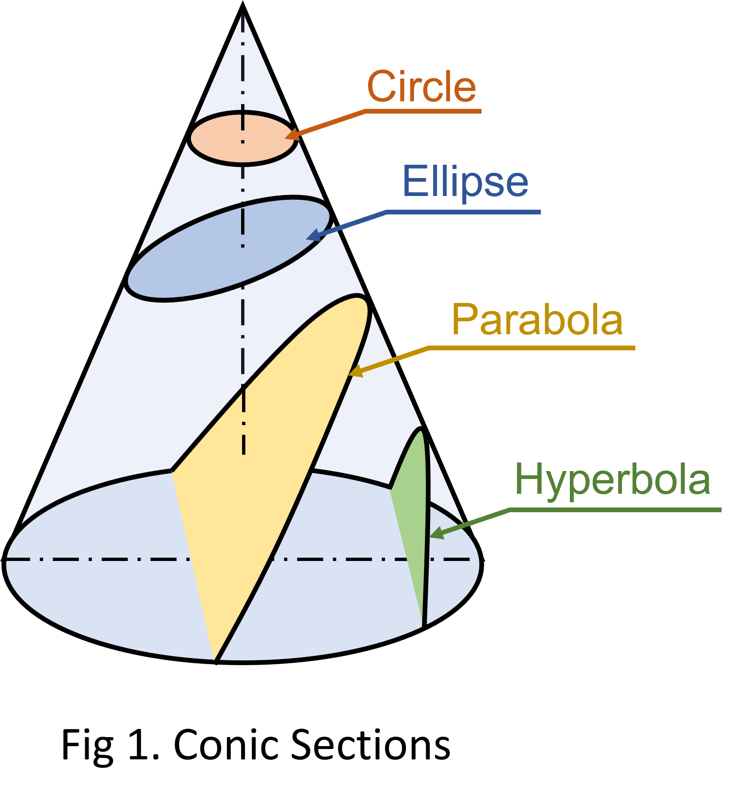
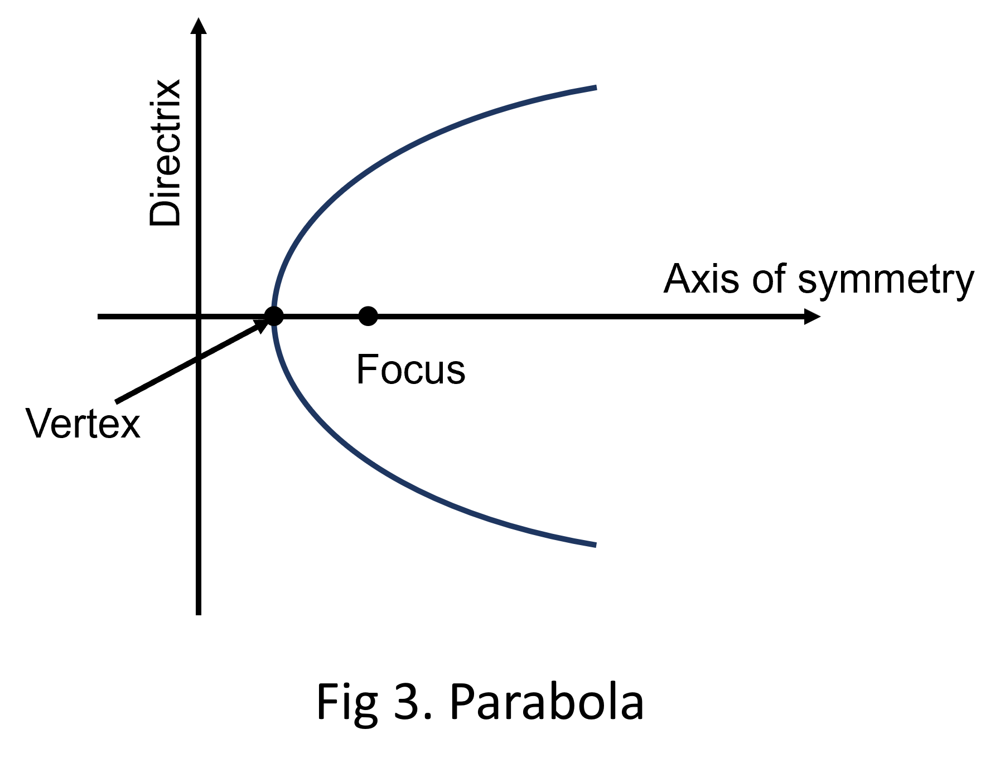

### Theory

#### Cone
A cone is a surface generated by rotating a straight line such that it always keeps contact with a closed curve, called base and contains a fixed point which does not lie in the plane of the curve.

#### Conic Sections
A conic section is originated from the convergence of a right circular cone by a plane in distinct positions relative to the axis of the cone.  

  

The locus of a point moving in a plane such that the ratio of the distance of the point from focus to the distance of the point from the directrix is always the same. This ratio is termed eccentricity (e).  

  

#### 1. Ellipse
An ellipse is formed when the plane is inclined to the axis, cutting all the generators on one side of the axis. Its eccentricity is less than 1. An ellipse has two foci and two directrices.  

  

#### 2. Parabola
A Parabola is formed when the plane runs parallel to one of the generators and is inclined to the axis. Its eccentricity is always equal to 1. A parabola has one focus and one directrix.  

  

#### 2. Hyperbola
A hyperbola is formed when two cones face each other and are intersected by a plane that is parallel to the axes of the cone. The eccentricity of this type of conic section is greater than 1.  

  

 

A **Parabola** is found in numerous forms in real life such as a ball thrown high forms a parabolic path, automobile headlights and the bulbs in lighthouses are also parabolic, many architectural structures are built in parabolic geometry.   
**Ellipse** is used to reflect sound and light. Also when a cylindrical shape is cut at by a cutting plane inclined to its axis, the section shape obtained is ellipse.  
The sides of a guitar are in **Hyperbolic** shape and hyperbolic gears are found in gear transmissions.
